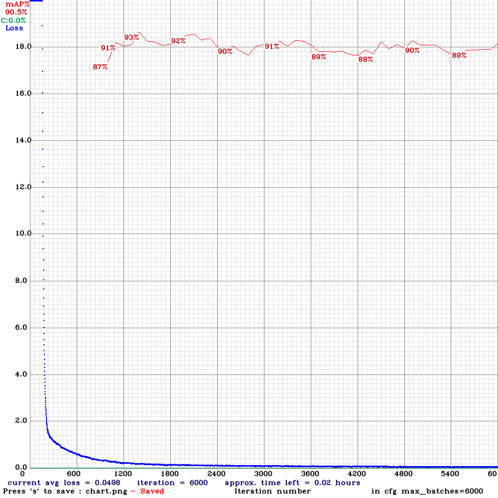
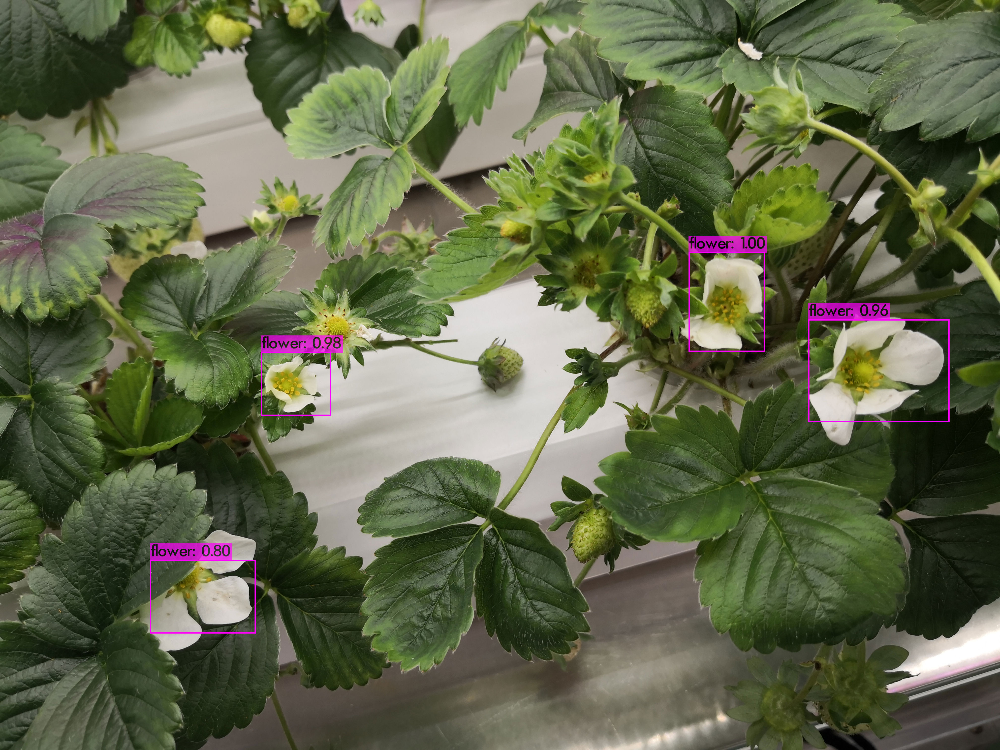

### Strawberry Flowers Detector 
First Phase: (Completed on 2021-10-11)
- Implement a detection model for detecting the location of strawberry flowes in 2 dimensions.

Second Phase: (In progress)
- Implement a classifier for classifying a flower is ready for pollination or not.

Third Phase: (Pending)
- Implement a Depth Evaluator for determine the location of strawberry flower in 3 dimensions.   


### Working Environemnt: 
- Cuda: 10.1
- Cudnn: 7
- OpenCV: 3.4.8
- Cmake: 3.16.3
- Python: 3.7 

### Training data: 
- Data collected from Hong Kong Vegetable Marketing Organization ([VMO](https://www.vmo.org/?fbclid=IwAR3Lgiecqcd8clfMTHnLKpwK5ZoIVQzH9yuNOMiBeq5FTi4YQY41U2u-67s)) 

### Usage:
Docker build,
```
docker build -t flower-detection-train .
```
Docker run,
```
docker run -it --gpus all -v $PWD:/app/ flower-detection-train /bin/bash
```

Start the training,
```
./darknet detector train ./Flower_detection/cfg/flower.data ./Flower_detection/cfg/yolov4-tiny-obj.cfg ./Flower_detection/cfg/yolov4-tiny.conv.29 -map
```

Validate the training,
```
./darknet detector test ./Flower_detection/cfg/flower.data ./Flower_detection/cfg/yolov4-tiny-obj.cfg ./Flower_detection/cfg/weights/yolov4-tiny-obj_2000.weights ./Flower_detection/test.jpg
```

### Results:




[More photos ~](results)

### Acknowledgements & Collaborations:
- Hong Kong Vegetable Marketing Organization ([VMO](https://www.vmo.org/?fbclid=IwAR3Lgiecqcd8clfMTHnLKpwK5ZoIVQzH9yuNOMiBeq5FTi4YQY41U2u-67s)) 
- The University of Hong Kong | Department of Electrical and Eletronic Engineering ([HKUEEE](https://www.eee.hku.hk/))

